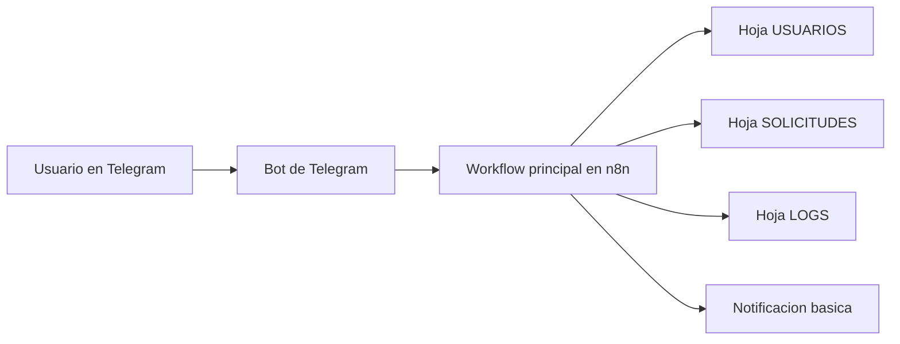

# HelpDeskBot

HelpDeskBot es un bot conversacional para gestionar solicitudes internas de soporte por medio de Telegram, con `n8n Community Edition` como motor de automatizacion y `Google Sheets` como capa de persistencia.

Su objetivo es ordenar la atencion de incidentes tecnicos, solicitudes administrativas y consultas generales mediante un flujo guiado, validaciones basicas y registro trazable de cada interaccion.

## Alcance funcional

- Menu conversacional numerico y sencillo.
- Creacion guiada de solicitudes.
- Consulta de estado por ticket.
- Consulta de solicitudes del usuario.
- Reportes basicos.
- Configuracion y validacion de usuario activo.
- Registro de acciones en `LOGS`.

## Menu principal

```text
Hola, soy HelpDeskBot 👋

Estoy aqui para ayudarte con solicitudes de soporte
de forma rapida y ordenada.

Por favor escribe el numero de la opcion que quieras usar.

Menu principal:
0. Ayuda
1. Crear solicitud
2. Consultar estado de solicitud
3. Mis solicitudes
4. Reportes
5. Configuracion
```

## Flujo guiado de creacion

1. Seleccion del tipo de solicitud.
2. Seleccion de prioridad.
3. Registro de descripcion.
4. Confirmacion de datos.
5. Guardado en `Google Sheets`.
6. Confirmacion al usuario.

## Tipos de solicitud

- `1`: Soporte tecnico
- `2`: Solicitud administrativa
- `3`: Consulta general
- `9`: Cancelar

## Arquitectura general



## Modelo de datos

### Hoja `SOLICITUDES`

| Campo | Descripcion |
| --- | --- |
| `id_ticket` | Identificador unico del ticket |
| `tipo` | Categoria de la solicitud |
| `prioridad` | `Alta`, `Media` o `Baja` |
| `descripcion` | Detalle escrito por el usuario |
| `estado` | `Abierto`, `En proceso` o `Cerrado` |
| `creado_por` | Usuario de Telegram que origina la solicitud |
| `fecha_creacion` | Fecha y hora de registro |

### Hoja `USUARIOS`

| Campo | Descripcion |
| --- | --- |
| `telegram_user` | Identificador o username de Telegram |
| `nombre` | Nombre visible del usuario |
| `rol` | Rol operativo o administrativo |
| `activo` | Indicador de acceso (`SI` o `NO`) |

### Hoja `LOGS`

| Campo | Descripcion |
| --- | --- |
| `timestamp` | Fecha y hora del evento |
| `telegram_user` | Usuario que interactuo |
| `pantalla` | Menu o paso actual |
| `opcion` | Valor ingresado por el usuario |
| `resultado` | Resultado del flujo o validacion |

## Validaciones obligatorias

- Verificar que el usuario exista y este activo.
- Exigir tipo, prioridad y descripcion en la creacion.
- Aceptar solo prioridades validas.
- Solicitar confirmacion antes de guardar.
- Registrar cada paso importante en `LOGS`.

## Automatizaciones obligatorias

- Registro automatico del ticket.
- Estado inicial en `Abierto`.
- Cambio posterior a `En proceso` o `Cerrado`.
- Notificacion basica por Telegram o correo.
- Trazabilidad mediante `LOGS`.

## Estructura sugerida del repositorio

```text
.
├── README.md
├── docker-compose.yml
├── .env.example
├── .gitignore
├── docs/
│   ├── entrega.md
│   ├── flujo-n8n.md
│   └── instalacion.md
└── workflows/
    └── README.md
```

## Que debe incluir la entrega

El proyecto no necesita entregarse como una instalacion completa de `n8n` dentro del repositorio. Lo correcto es entregar:

1. La documentacion funcional y tecnica.
2. El archivo `.json` exportado del workflow de `n8n`.
3. La estructura de `Google Sheets`.
4. Evidencias de funcionamiento del bot en Telegram.
5. Instrucciones para reproducir la configuracion local.

La guia detallada esta en [docs/entrega.md](/home/zeven/Documentos/HelpDeskBot_N8N/docs/entrega.md).

## Puesta en marcha

1. Crear el bot en Telegram y obtener el token.
2. Crear el documento `HelpDeskBot_DB` en Google Sheets con las hojas requeridas.
3. Copiar `.env.example` a `.env` y ajustar variables.
4. Levantar `n8n` con `docker compose up -d`.
5. Configurar credenciales en `n8n`.
6. Importar el workflow exportado.
7. Ejecutar pruebas desde Telegram.

La instalacion paso a paso esta en [docs/instalacion.md](/home/zeven/Documentos/HelpDeskBot_N8N/docs/instalacion.md), el detalle del flujo esta en [docs/flujo-n8n.md](/home/zeven/Documentos/HelpDeskBot_N8N/docs/flujo-n8n.md) y el avance observado del workflow esta en [docs/avance-actual.md](/home/zeven/Documentos/HelpDeskBot_N8N/docs/avance-actual.md).
