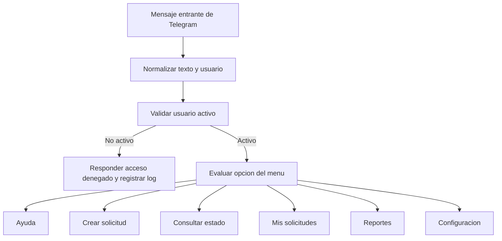

# Documentacion del flujo en n8n

Este documento describe el comportamiento funcional esperado del workflow principal de HelpDeskBot. Los nombres exactos de nodos pueden variar, pero la logica debe mantenerse.

Si quieres contrastar este diseno esperado con el flujo que ya tienes montado, revisa tambien [docs/avance-actual.md](/home/zeven/Documentos/HelpDeskBot_N8N/docs/avance-actual.md).

## Objetivo del workflow

Recibir mensajes desde Telegram, interpretar opciones numericas, validar al usuario y ejecutar acciones sobre `Google Sheets` para registrar, consultar y reportar solicitudes.

## Flujo principal



## Menus y respuestas

### Opcion `0`: Ayuda

- Reenviar el menu principal.
- Explicar que el usuario debe responder solo con numeros validos.
- Registrar el evento en `LOGS`.

### Opcion `1`: Crear solicitud

El bot ejecuta un wizard conversacional:

1. Solicitar tipo.
2. Solicitar prioridad.
3. Solicitar descripcion.
4. Mostrar resumen.
5. Pedir confirmacion.
6. Guardar ticket.
7. Confirmar creacion al usuario.

### Opcion `2`: Consultar estado de solicitud

- Solicitar `id_ticket`.
- Buscar el ticket en `SOLICITUDES`.
- Responder estado actual y datos principales.
- Registrar la consulta en `LOGS`.

### Opcion `3`: Mis solicitudes

- Filtrar `SOLICITUDES` por `creado_por`.
- Mostrar las solicitudes recientes del usuario.
- Registrar la accion en `LOGS`.

### Opcion `4`: Reportes

- Permitir un resumen basico por estado, prioridad o tipo.
- Idealmente restringir esta opcion a roles autorizados.
- Registrar el acceso en `LOGS`.

### Opcion `5`: Configuracion

- Mostrar datos basicos del usuario.
- Confirmar si el usuario esta activo.
- Reservar espacio para preferencias futuras.

## Detalle del wizard de creacion

### Paso 1. Tipo

Mensaje esperado:

```text
Vamos a crear una solicitud, para lo cual se necesitara escoger su tipo.

Selecciona el tipo:
1. Soporte tecnico
2. Solicitud administrativa
3. Consulta general
9. Cancelar
```

Validaciones:

- Solo aceptar `1`, `2`, `3` o `9`.
- Si el usuario cancela, cerrar el flujo y registrar en `LOGS`.

### Paso 2. Prioridad

Valores validos:

- `Alta`
- `Media`
- `Baja`

Si trabajas todo con entradas numericas, puedes mapear:

- `1`: Alta
- `2`: Media
- `3`: Baja

### Paso 3. Descripcion

- La descripcion es obligatoria.
- Debe almacenarse tal como la escribe el usuario, salvo limpieza basica de espacios.

### Paso 4. Confirmacion

Antes de guardar, mostrar un resumen:

```text
Confirma tu solicitud:
Tipo: Soporte tecnico
Prioridad: Alta
Descripcion: No tengo acceso al correo

1. Confirmar
9. Cancelar
```

### Paso 5. Registro

Al confirmar:

- Generar `id_ticket`.
- Crear fila en `SOLICITUDES`.
- Definir estado inicial como `Abierto`.
- Registrar evento en `LOGS`.
- Enviar mensaje de exito.

Formato sugerido para `id_ticket`:

```text
HD-YYYYMMDD-HHMMSS
```

## Validaciones obligatorias

- Usuario existente y activo en `USUARIOS`.
- Tipo obligatorio.
- Prioridad valida.
- Descripcion obligatoria.
- Confirmacion explicita antes del guardado.

## Automatizaciones obligatorias

### Registro automatico

Cada solicitud confirmada debe crear una fila nueva en `SOLICITUDES`.

### Cambio de estado

Estados previstos:

- `Abierto`
- `En proceso`
- `Cerrado`

El cambio puede hacerse desde otro flujo administrativo o mediante actualizacion manual controlada.

### Notificacion basica

Como minimo debe existir una confirmacion al usuario por Telegram. Si el proyecto lo contempla, puede agregarse correo como notificacion complementaria.

### Registro en LOGS

Acciones minimas a registrar:

- Entrada al menu.
- Opcion elegida.
- Usuario no activo.
- Inicio y cancelacion del wizard.
- Ticket creado.
- Consulta de ticket.
- Error de validacion.

## Recomendacion tecnica importante

Para que el wizard funcione bien entre varios mensajes, necesitas manejar el estado conversacional del usuario. Eso puede resolverse de diferentes formas:

1. Reconstruyendo el paso actual desde `LOGS`.
2. Usando almacenamiento temporal interno del workflow.
3. Agregando una hoja opcional de sesiones si el proyecto crece.

Si la entrega academica exige respetar exactamente el modelo de datos dado, la opcion mas segura es documentar el estado en `LOGS` y mantener el flujo lo mas simple posible.
